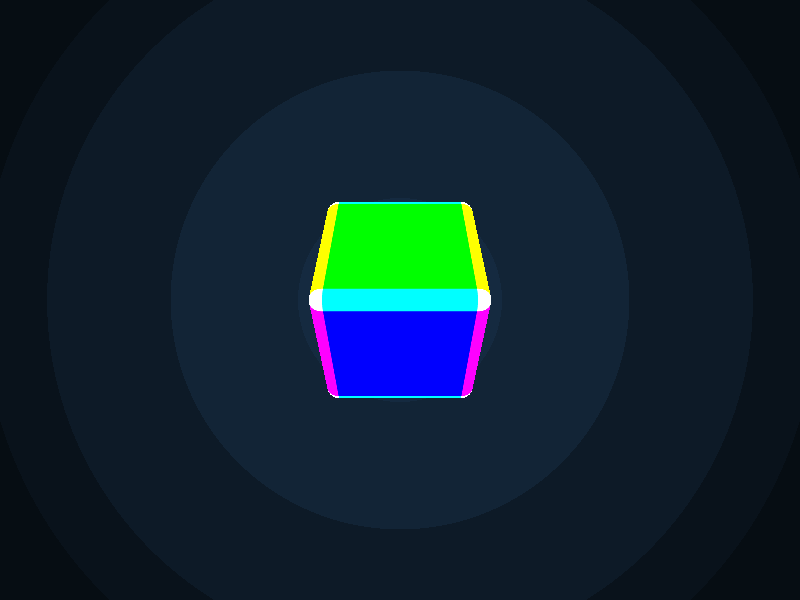

# py2glsl

<p align="center">
  
</p>

Transform Python functions into GLSL shaders with zero boilerplate.
Write complex shaders in pure Python with type hinting,
including custom structs and global constants, then render them as real-time animations,
images, GIFs, or videos—all with proper IDE support and no GLSL knowledge required
(though it helps!).

## Quick Start

Install using uv to get both the library and command-line tool:

```bash
uv pip install py2glsl
```

Create a simple animated shader file `plasma.py`:

```python
from py2glsl import ShaderContext
from py2glsl.builtins import length, sin, vec4

def shader(ctx: ShaderContext) -> vec4:
    """A simple animated plasma shader."""
    uv = ctx.vs_uv * 2.0 - 1.0  # Center UV coordinates
    d = length(uv)
    color = sin(d * 10.0 - ctx.u_time * 2.0) * 0.5 + 0.5
    return vec4(color, color * 0.5, 1.0 - color, 1.0)
```

Run it using the command-line interface:

```bash
# Interactive preview
py2glsl show plasma.py

# Save as image
py2glsl image plasma.py output.png

# Create animated GIF
py2glsl gif plasma.py animation.gif --duration 5.0

# Specify a particular function to use (default is 'shader')
py2glsl show plasma.py --main my_custom_shader

# Export code for Shadertoy (paste-able to shadertoy.com)
py2glsl export plasma.py --target shadertoy
```

Or use the library directly in your code:

```python
from py2glsl.render import animate
from plasma import shader  # Import your shader function

# Run real-time animation at 30fps
animate(shader, fps=30)
```

## Features

- **Python-to-GLSL Transpilation**: Write shaders in Python with full type hinting,
  custom structs, and global constants—automatically converted to GLSL.
- **ShaderContext API**: Access built-in uniforms (`u_time`, `u_resolution`, `u_aspect`,
  `u_mouse_pos`, `u_mouse_uv`) and inputs (`vs_uv`) through a clean context object.
- **Built-in GLSL Functions**: Use familiar functions like sin, cos, length, normalize,
  and more directly in Python.
- **Command-Line Interface**:
  - Interactive preview with `py2glsl show`
  - Static image rendering with `py2glsl image`
  - Video rendering with `py2glsl video`
  - GIF creation with `py2glsl gif`
  - Code export with `py2glsl export` (supports Shadertoy export)
- **Flexible Rendering API**:
  - Real-time animations with `animate()` (with framerate control)
  - Static images with `render_image()`
  - Animated GIFs with `render_gif()`
  - Videos with `render_video()`
- **Multiple Target Platforms**:
  - OpenGL 4.6 (default)
  - OpenGL 3.3
  - Shadertoy
  - WebGL 2
- **IDE-Friendly**: Leverages Python's type system for autocompletion and error checking.
- **No GLSL Boilerplate**: Focus on shader logic without writing vertex/fragment wrappers.

## Installation

For users:

```bash
# Using uv (recommended)
uv pip install py2glsl

# From source with uv
uv pip install git+https://github.com/alexeykarnachev/py2glsl.git

# Using pipx (for command-line usage only)
pipx install py2glsl
```

For development:

```bash
git clone https://github.com/alexeykarnachev/py2glsl.git
cd py2glsl
uv venv
source .venv/bin/activate  # or .venv/Scripts/activate on Windows
uv sync
```

Install pre-commit hooks:

```bash
uv pip install pre-commit
pre-commit install
```

## Command-Line Interface

py2glsl provides a comprehensive command-line interface for working with shaders.

### Interactive Preview

```bash
py2glsl show shader_file.py [OPTIONS]

Options:
  -t, --target TEXT      Target platform (glsl, opengl33, webgl)  [default: glsl]
  -m, --main TEXT        Specific shader function to use
  -w, --width INTEGER    Window width  [default: 800]
  -h, --height INTEGER   Window height  [default: 600]
  --fps INTEGER          Target framerate (0 for unlimited)  [default: 30]
```

### Render to Image

```bash
py2glsl image shader_file.py output.png [OPTIONS]

Options:
  -t, --target TEXT      Target platform (glsl, opengl33, webgl)  [default: glsl]
  -m, --main TEXT        Specific shader function to use
  -w, --width INTEGER    Image width  [default: 800]
  -h, --height INTEGER   Image height  [default: 600]
  --time FLOAT           Time value for the image  [default: 0.0]
```

### Render to Video

```bash
py2glsl video shader_file.py output.mp4 [OPTIONS]

Options:
  -t, --target TEXT      Target platform (glsl, opengl33, webgl)  [default: glsl]
  -m, --main TEXT        Specific shader function to use
  -w, --width INTEGER    Video width  [default: 800]
  -h, --height INTEGER   Video height  [default: 600]
  --fps INTEGER          Frames per second  [default: 30]
  -d, --duration FLOAT   Duration in seconds  [default: 5.0]
  -s, --start FLOAT      Starting time for animation  [default: 0.0]
  --codec TEXT           Video codec (h264, vp9)  [default: h264]
  -q, --quality INTEGER  Video quality (0-10)  [default: 8]
```

### Render to GIF

```bash
py2glsl gif shader_file.py output.gif [OPTIONS]

Options:
  -t, --target TEXT      Target platform (glsl, opengl33, webgl)  [default: glsl]
  -m, --main TEXT        Specific shader function to use
  -w, --width INTEGER    GIF width  [default: 800]
  -h, --height INTEGER   GIF height  [default: 600]
  --fps INTEGER          Frames per second  [default: 30]
  -d, --duration FLOAT   Duration in seconds  [default: 5.0]
  -s, --start FLOAT      Starting time for animation  [default: 0.0]
```

### Export Shader Code

```bash
py2glsl export shader_file.py [output.glsl] [OPTIONS]

Options:
  -t, --target TEXT      Target platform (glsl, shadertoy, webgl)  [default: glsl]
  -m, --main TEXT        Specific shader function to use
```

**Note:** The `shadertoy` target outputs clean code that can be directly pasted into
[shadertoy.com](https://shadertoy.com). It is export-only and cannot be used for local
rendering. Use `glsl` or `opengl33` targets for development and preview.

## Library Usage

### Basic Shader

```python
from py2glsl import ShaderContext
from py2glsl.builtins import length, smoothstep, vec4
from py2glsl.render import render_image


def shader(ctx: ShaderContext) -> vec4:
    """A static circle shader."""
    d = length(ctx.vs_uv * 2.0 - 1.0)
    color = 1.0 - smoothstep(0.0, 0.01, d - 0.5)
    return vec4(color, color, color, 1.0)


# Save as PNG
render_image(shader).save("circle.png")
```

### Animated Shader (GIF)

```python
from py2glsl import ShaderContext, TargetType
from py2glsl.builtins import length, sin, vec4
from py2glsl.render import render_gif


def shader(ctx: ShaderContext) -> vec4:
    """An animated ripple effect."""
    uv = ctx.vs_uv * 2.0 - 1.0
    d = length(uv)
    wave = sin(d * 10.0 - ctx.u_time * 2.0) * 0.5 + 0.5
    return vec4(wave, wave * 0.5, 1.0 - wave, 1.0)


# Create animated GIF
render_gif(shader, duration=2.0, fps=30, output_path="ripple.gif")

# Export to Shadertoy format (for pasting to shadertoy.com):
from py2glsl import transpile, TargetType
shadertoy_code, _ = transpile(shader, target=TargetType.SHADERTOY)
print(shadertoy_code)  # Paste this to shadertoy.com
```

### Advanced Example: Ray Marching

Here's a more complex example using ray marching with structs and global constants:

```python
from dataclasses import dataclass

from py2glsl import ShaderContext, transpile
from py2glsl.builtins import length, sin, vec3, vec4, normalize
from py2glsl.render import animate

# Global constants
PI: float = 3.141592
RM_MAX_DIST: float = 10000.0
RM_MAX_STEPS: int = 64
RM_EPS: float = 0.0001


@dataclass
class RayMarchResult:
    steps: int
    p: vec3
    normal: vec3
    ro: vec3
    rd: vec3
    dist: float
    sd_last: float
    sd_min: float
    sd_min_shape: float
    has_normal: bool


def get_sd_shape(p: vec3) -> float:
    """Signed distance to a sphere."""
    return length(p) - 1.0


def march(ro: vec3, rd: vec3) -> RayMarchResult:
    """Ray marching function."""
    rm = RayMarchResult(
        steps=0,
        p=ro,
        normal=vec3(0.0),
        ro=ro,
        rd=rd,
        dist=0.0,
        sd_last=0.0,
        sd_min=RM_MAX_DIST,
        sd_min_shape=RM_MAX_DIST,
        has_normal=False,
    )
    for i in range(RM_MAX_STEPS):
        rm.steps = i
        rm.p = rm.p + rm.rd * rm.sd_last
        rm.sd_last = get_sd_shape(rm.p)
        rm.dist = rm.dist + length(rm.p - rm.ro)
        if rm.sd_last < RM_EPS or rm.dist > RM_MAX_DIST:
            break
    return rm


def shader(ctx: ShaderContext) -> vec4:
    """Ray-marched sphere with animation."""
    ro = vec3(0.0, 0.0, 5.0 + sin(ctx.u_time))
    rd = normalize(vec3(ctx.vs_uv * 2.0 - 1.0, -1.0))
    rm = march(ro, rd)
    color = vec3(0.1, 0.2, 0.3)  # Background
    if rm.sd_last < RM_EPS:
        color = vec3(1.0, 0.5, 0.2)  # Hit color
    return vec4(color, 1.0)


# Transpile with constants and structs
glsl_code, _ = transpile(
    march,
    get_sd_shape,
    shader,
    RayMarchResult,
    PI=PI,
    RM_MAX_DIST=RM_MAX_DIST,
    RM_MAX_STEPS=RM_MAX_STEPS,
    RM_EPS=RM_EPS,
)

# Run animation with 30fps limit
animate(glsl_code, fps=30)
```

### Debugging GLSL Output

```python
from py2glsl import ShaderContext, TargetType, transpile
from py2glsl.builtins import vec4


def shader(ctx: ShaderContext) -> vec4:
    return vec4(ctx.vs_uv, 0.0, 1.0)


glsl_code, uniforms = transpile(shader)
print("Fragment Shader:")
print(glsl_code)

# Transpile to Shadertoy format (paste-able to shadertoy.com)
shadertoy_code, _ = transpile(shader, target=TargetType.SHADERTOY)
print("Shadertoy code (paste to shadertoy.com):")
print(shadertoy_code)
```

### Advanced Rendering Options

```python
from py2glsl import ShaderContext, TargetType
from py2glsl.builtins import vec4, sin, length
from py2glsl.render import animate, render_video, render_gif


def shader(ctx: ShaderContext) -> vec4:
    """Simple animated color shader."""
    d = length(ctx.vs_uv * 2.0 - 1.0)
    c = sin(d * 10.0 - ctx.u_time * 2.0) * 0.5 + 0.5
    return vec4(c, c * 0.5, 1.0 - c, 1.0)


# Real-time animation with frame rate control
animate(shader, fps=30)  # Cap at 30fps
animate(shader, fps=0)   # Unlimited frame rate (default)

# Interactive animation with OpenGL 3.3 target (for older systems)
animate(shader, target=TargetType.OPENGL33, fps=60)

# Video rendering with different settings
render_video(
    shader,
    size=(1920, 1080),  # Full HD
    duration=5.0,       # 5 seconds
    fps=60,             # 60 frames per second
    output_path="shader.mp4",
    codec="h264",       # Video codec
    quality=8,          # Quality level (0-10)
)

# GIF with custom parameters
render_gif(
    shader,
    size=(600, 600),    # Square dimensions
    duration=3.0,       # 3 seconds loop
    fps=24,             # 24 frames per second
    output_path="shader.gif",
    time_offset=1.0,    # Start animation from time=1.0
)
```

## ShaderContext

The `ShaderContext` provides access to built-in shader inputs and uniforms:

| Attribute | Type | Description |
|-----------|------|-------------|
| `vs_uv` | `vec2` | Fragment UV coordinates (0.0 to 1.0) |
| `u_time` | `float` | Time in seconds since start |
| `u_resolution` | `vec2` | Viewport resolution in pixels |
| `u_aspect` | `float` | Aspect ratio (width / height) |
| `u_mouse_pos` | `vec2` | Mouse position in pixels |
| `u_mouse_uv` | `vec2` | Mouse position in UV coordinates |

## License

MIT License - see [LICENSE](./LICENSE) for details.
